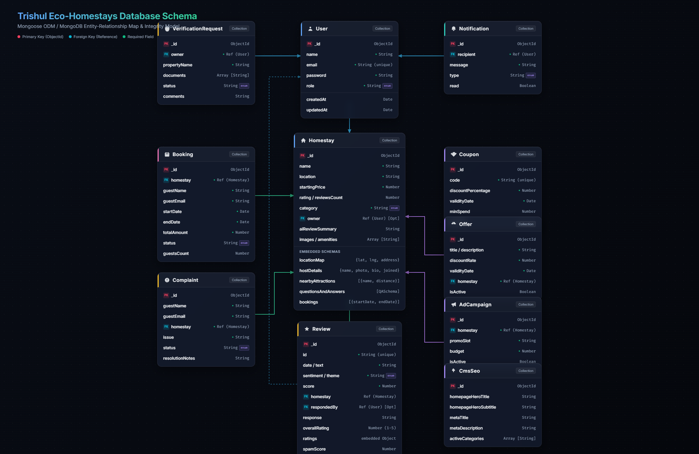

# Trishul Eco-Homestays Network & AI Reviews Platform

This is a comprehensive, production-grade full-stack lodging and review telemetry platform designed for **Trishul Eco-Homestays** in the Himalayas. It integrates reservation engines, dashboard panels, and advanced AI utilities for guests, owners, staff, and system administrators.

---

## 🌟 Core System Features

### 1. Guest Stays Catalog & Smart Search (`/`)
* **NLP Smart Search**: Allows users to type natural language sentences (e.g. *"quiet mountain cabin with fireplace and WiFi"*) and parses key terms to query corresponding categories, descriptions, and amenities.
* **Filter Sidebar**: Slide-out filtering controls allowing guests to narrow down options by:
  - Price Range (interactive slider limits)
  - Minimum guest star ratings (4.5★+, 4.0★+, etc.)
  - Amenities checklists (WiFi, AC, Breakfast, Parking, Pool, Pet/Family Friendly, etc.)
  - Booking cancellation policies (Free Cancellation checks)
  - Max distance proximity sliders
* **AI Match Score**: Dynamic matching percentage labels overlaying listing cards indicating how closely a homestay satisfies guest preferences.

### 2. Homestay Profile & Payment Checkout Wizard (`/homestay/[id]`)
* **AI Seasonal Price Predictor**: Interactive SVG-based monthly bar and trend charts showing pricing shifts for the upcoming 6 months to predict optimal booking times.
* **AI Review Summary**: Dynamic synthesis engine showing synthesized pros/cons from logged guest reviews.
* **Sentiment Overview Bar**: Color-coded breakdown bar detailing the proportion of Positive (Green), Neutral (Yellow), and Negative (Red) guest logs.
* **Detailed Reviews Hub**:
  - Reviews sorting (Newest, Highest, Lowest, Most Helpful).
  - Verified Stay checks & Spam Detection badges (spam warning triggers for reviews with `spamScore > 75`).
  - Helpful voting counters (incrementing live via `/api/reviews/:id/vote`).
  - Translation toggle (interactive Kumaoni/Hindi translation via `/api/reviews/:id/translate`).
  - Flagging/Reporting tool to report problematic posts.
* **Step-by-Step Checkout Wizard**:
  - **Step 1: Reservation Details**: Select dates and guest counts, calculating base rates and totals.
  - **Step 2: Simulated Payments**: Options for UPI, Credit/Debit Cards, and Wallets with input validation.
  - **Step 3: Verification Gateway**: Animated secure payment processing loader.
  - **Step 4: Invoice Receipt**: Printable receipt page showing breakdown of stays, taxes, and unique transaction codes.

### 3. Dedicated Management Dashboards
* **Staff Console (`/classifier`)**: Automated review classifier displaying sentiment indexes, source channels, and auto-generated response drafts powered by Google Gemini AI.
* **Owner Dashboard (`/dashboard/owner`)**:
  - Analytics (revenue counters, reviews count growth, monthly visitor charts).
  - Interactive Monthly Calendar blocking out booked dates.
  - Coupon & Offers creation manager.
  - Notifications inbox alerts.
* **Admin Dashboard (`/dashboard/admin`)**:
  - Approve verification documents for new properties.
  - global ledger tracking bookings and ad budgets.
  - Complaints log tracker.
  - CMS content & SEO metadata manager (dynamic headers, descriptions, keywords).

---

## 📊 Database Schema Diagram

The database uses MongoDB with Mongoose as the ODM. The schema consists of core collections (User, Homestay, Booking), user feedback/support systems (Review, Complaint), and administrative/marketing modules (Notification, VerificationRequest, Coupons, Offers, Campaigns, and SEO configuration).

Below is the visual Entity-Relationship Diagram (ERD) mapping the schemas, field types, primary/foreign key connections, and constraints:



### Key Relationships & Data Flow:
* **User & Homestay**: A `User` (specifically with `role: "Owner"`) can own multiple `Homestays` (1-to-many relationship linked via `owner`).
* **Homestay & Booking**: Guests book a specific homestay, creating a `Booking` linked via `homestay` (1-to-many relationship).
* **Homestay & Feedback**: Both `Review` and `Complaint` documents are linked directly to their target `Homestay` via reference fields.
* **Review & Response**: Reviews can have response drafts created and responded to by system users (Staff, Admins, or Owners), linked via the `respondedBy` field.
* **Owner & Verification**: Owners submit property documents via `VerificationRequest` objects for Admin approval, linked via the `owner` field.
* **Marketing & Promotions**: Promotions like `Offer` and `AdCampaign` are tied to specific `Homestays` to manage campaign slots, validity, and advertising budgets.

---

## 📂 Project Structure

```text
├── app/                        # Next.js App Router Pages
│   ├── classifier/             # Staff Classifier page
│   ├── dashboard/
│   │   ├── admin/              # Admin Panel page
│   │   └── owner/              # Owner Console page
│   ├── homestay/
│   │   └── [id]/               # Details Page & Booking wizard
│   ├── login/                  # Role-based Redirection portal
│   ├── layout.jsx              # Global app layouts
│   └── page.js                 # Catalog, Search & Sidebar filters
├── components/                 # Shared React Components
│   ├── ui/                     # UI components (Button, Modal, Input, Loader, Toast)
│   ├── Footer.jsx
│   ├── Navbar.jsx              # Role status navbar headers
│   └── Hero.jsx
├── backend/                    # Express.js Server
│   ├── config/                 # DB connectors & parameters
│   ├── controllers/            # Controller routers handlers (Admin, Owner, Reviews, Stays)
│   ├── models/                 # Mongoose Schemas (User, Homestay, Review, Booking, Marketing, Notification)
│   ├── routes/                 # Express REST Routers
│   ├── seed.js                 # Database mock seeding script
│   └── server.js               # Main entry point & API mount
```

---

## 🛠️ Database Setup & Seeding

The application connects to a cloud MongoDB instance. To initialize/reset the database with default owners, admins, notifications, and mock bookings:

1. Navigate to the backend directory:
   ```bash
   cd backend
   ```
2. Execute the seeding script:
   ```bash
   node seed.js
   ```

---

## 🚀 Running the App Locally

Ensure MongoDB connectivity is active, and launch both frontend and backend development servers.

### 1. Backend API (Port `5000`)
1. Create a `backend/.env` file from `.env.example`.
2. Install dependencies:
   ```bash
   npm install
   ```
3. Run the development server:
   ```bash
   npm run dev
   ```

### 2. Frontend Next.js (Port `3000`)
1. Install root dependencies:
   ```bash
   npm install
   ```
2. Start the hot-reloading server:
   ```bash
   npm run dev
   ```
3. Open [http://localhost:3000](http://localhost:3000) in your web browser.

---

## 🔑 Login Credentials

Use these preset seeded accounts to navigate role-specific portals:
- **Staff Portal**: `staff@trishul.com` / `staff123`
- **Owner Dashboard**: `owner@trishul.com` / `owner123`
- **Admin Console**: `admin@trishul.com` / `admin123`
